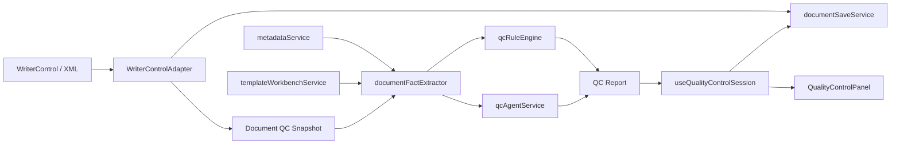

# 医疗文书质控 Agent 需求设计

## 1. 背景与目标

当前 `emr-web-editor-mvp` 已具备临床文书 Web 编辑器壳层：Vue 前端通过 `WriterControlAdapter` 接入底层 WriterControl，`EditorShell` 编排模板、文书会话、保存、打印和属性面板，`documentSaveService` 在保存前调用 `documentValidationService` 做基础 XML 和必填项校验，`ValidationPanel` 展示保存前问题。

本阶段目标是在不重写编辑器内核的前提下，新增 **医疗文书质控 Agent**。该 Agent 采用“规则优先 + Agent 语义审阅 + 医生确认”的方案 B：

- 规则层先抽取结构化事实并执行确定性校验。
- Agent 层只处理需要医学语义理解的质控项。
- 所有结果必须结构化、可解释、可追溯到字段或文书片段。
- AI 只提供质控建议，不直接替代医生判断，也不自动修改文书。

本阶段命名为：**医疗文书质控 Agent：基于结构化规则和可解释 Agent 的文书质量审阅能力**。

## 2. 外部参考原则

成熟医疗 AI 文档方案的共同约束是：证据来源明确、人工复核、风险分级、可审计、持续评估。

- Microsoft Dragon Copilot / DAX Copilot：强调临床工作流内的文档自动化和医生工作负担降低，而不是让 AI 独立诊疗。
- AWS HealthScribe：临床文档生成应保留来源映射和人工复核边界，避免无证据文本直接进入病历。
- Google MedLM / Med-PaLM：医学 LLM 可用于摘要、问答和文档辅助，但需要领域评估、受控输入和安全部署。
- HL7 FHIR Composition / DocumentReference：临床文档应有结构化文档单元、来源、状态和引用边界。
- CDS Hooks：临床决策支持应以工作流触发、服务返回卡片、建议和链接的方式嵌入系统。
- WHO、FDA、NIST AI 风险管理资料：医疗 AI 需要透明性、人工监督、风险控制、监测和责任边界。
- PDQI-9：可作为文书质量评估维度的参考，包括完整性、准确性、组织性、简洁性、清晰性等。

参考链接：

- Microsoft Dragon Copilot: https://www.microsoft.com/en-us/health-solutions/clinical-workflow/dragon-copilot
- Microsoft Learn Dragon Copilot: https://learn.microsoft.com/en-us/industry/healthcare/dragon-copilot/
- AWS HealthScribe Responsible AI: https://docs.aws.amazon.com/ai/responsible-ai/aws-healthscribe/overview.html
- Google MedLM: https://cloud.google.com/vertex-ai/generative-ai/docs/medlm/medlm-prompts
- Google Med-PaLM: https://sites.research.google/med-palm/
- HL7 FHIR Composition: https://hl7.org/fhir/composition.html
- HL7 FHIR DocumentReference: https://hl7.org/fhir/documentreference.html
- CDS Hooks: https://cds-hooks.hl7.org/
- WHO AI for Health: https://www.who.int/publications/i/item/9789240029200
- FDA CDS Software Guidance FAQ: https://www.fda.gov/medical-devices/software-medical-device-samd/clinical-decision-support-software-frequently-asked-questions-faqs
- NIST AI RMF: https://www.nist.gov/itl/ai-risk-management-framework
- PDQI-9 PubMed: https://pubmed.ncbi.nlm.nih.gov/22577483/

## 3. 已确认范围

### 3.1 质控定位

采用“辅助质控 Agent”范围：

- 不做自动诊断。
- 不做医嘱推荐。
- 不自动改写或提交病历。
- 不替代上级医师、病案室或质控科最终审核。
- 优先帮助医生发现文书缺项、矛盾、不一致、不清晰和高风险遗漏。

### 3.2 MVP 质控能力

第一阶段纳入以下能力：

- 保存前结构化校验：XML 有效性、必填输入域、`ValidateStyle` 规则、数值范围、日期范围。
- 文书完整性校验：关键段落或关键字段缺失，如主诉、现病史、诊断、入院日期、出院日期、手术信息。
- 一致性校验：年龄/性别/诊断/手术/时间字段之间的明显冲突。
- Agent 语义审阅：根据抽取出的结构化事实和关键片段生成建议，例如主诉与现病史不一致、诊断与处置描述不一致、出院记录缺随访说明。
- 质控问题卡片：展示等级、类别、消息、证据、建议、定位信息和是否阻断保存。
- 医生处理动作：忽略、定位、标记已处理、接受建议文本但不自动写入。

第一阶段暂不纳入：

- 真实 HIS/EMR 数据库对接。
- 真实患者隐私数据处理。
- 自动病历改写和自动保存。
- 医嘱合理性审核、药物相互作用、诊疗路径强决策。
- 完整 FHIR 平台改造。
- 多模型路由和在线模型监控平台。

### 3.3 保存边界

保存仍由现有 `documentSaveService` 发起。新增质控后采用两级策略：

- 阻断保存：XML 解析失败、必填字段缺失、强规则错误、高风险日期/身份字段冲突。
- 不阻断保存：Agent 语义建议、表达优化建议、低置信度疑点。

医生可在 UI 中看到不阻断建议，但保存流程不得因为低风险 Agent 建议无限卡住。

## 4. 架构总览

新增能力以插件式方式接入现有编辑器。



### 4.1 前端新增模块

- `frontend/src/types/qualityControl.ts`
  - 定义质控请求、事实、规则、问题、报告、处理状态和 Agent 输出类型。

- `frontend/src/services/documentFactExtractor.ts`
  - 从 XML、输入域、`ValidateStyle`、元数据绑定、模板信息中抽取结构化事实。
  - 输出可测试的 `DocumentFacts`，供规则引擎和 Agent 共用。

- `frontend/src/services/qcRuleEngine.ts`
  - 执行确定性规则。
  - 不调用模型。
  - 负责高可信、可阻断的质控问题。

- `frontend/src/services/qcAgentService.ts`
  - 负责 Agent 审阅请求。
  - MVP 先提供 mock provider，返回稳定的结构化建议。
  - 后续可接后端 `/api/qc/analyze` 或真实模型。

- `frontend/src/composables/useQualityControlSession.ts`
  - 管理当前文书的质控状态、运行中状态、报告、忽略项、已处理项、错误信息。
  - 不直接操作 WriterControl。

- `frontend/src/components/editor/QualityControlPanel.vue`
  - 展示质控问题卡片。
  - 支持按等级、类别和处理状态过滤。
  - 发出定位、忽略、标记已处理、重新质控事件。

- `frontend/src/components/editor/QualityControlSummaryBar.vue`
  - 在编辑区或状态栏附近展示本次质控概览，如高危数、错误数、建议数、最近运行时间。

### 4.2 后端新增模块

MVP 后端保持轻量，但预留真实 Agent 服务边界：

- `POST /api/qc/analyze`
  - 输入：文书 id、文件名、文书来源、脱敏后的结构化事实、关键片段。
  - 输出：结构化 `QualityControlReport`。
  - MVP 可返回 mock 报告；后续替换为模型服务。

- `GET /api/qc/rules`
  - 返回当前启用的规则清单、版本、等级和说明。
  - MVP 可返回内置规则元数据。

- `POST /api/qc/reports`
  - 保存质控报告和医生处理动作。
  - MVP 可保存在内存 store；后续替换为审计库。

第一阶段可以先只实现前端 mock Agent。若实现后端接口，接口也必须保持无真实患者数据的演示边界。

## 5. 数据模型

### 5.1 文书事实

`DocumentFacts` 是质控 Agent 的核心输入，避免让模型直接面对完整原始 XML。

```ts
export interface DocumentFacts {
  documentId: string
  fileName: string
  source: DocumentSource
  templateId?: string
  generatedAt: string
  sections: ClinicalSectionFact[]
  fields: ClinicalFieldFact[]
  metadataBindings: MetadataBindingFact[]
  validationRules: FieldValidationRuleFact[]
  timeline: ClinicalTimelineFact[]
  snippets: EvidenceSnippet[]
}
```

关键原则：

- `sections` 用于文书段落完整性和上下文证据。
- `fields` 用于必填、空值、类型和值域校验。
- `metadataBindings` 用于数据元一致性。
- `validationRules` 用于解释 `ValidateStyle`。
- `timeline` 用于入院、出院、手术、记录时间等顺序检查。
- `snippets` 只保存必要证据片段，不保存完整无关文本。

### 5.2 质控问题

```ts
export interface QualityControlIssue {
  id: string
  category: 'required' | 'format' | 'timeline' | 'consistency' | 'completeness' | 'semantic' | 'safety'
  severity: 'critical' | 'error' | 'warning' | 'suggestion'
  title: string
  message: string
  suggestion: string
  evidence: EvidenceSnippet[]
  fieldId?: string
  fieldName?: string
  blocking: boolean
  confidence: number
  source: 'rule' | 'agent'
  status: 'open' | 'ignored' | 'resolved'
}
```

阻断规则：

- `critical` 和确定性 `error` 默认阻断保存。
- Agent 来源的 `warning` 和 `suggestion` 默认不阻断。
- Agent 来源的 `error` 只有在对应规则或明确证据支持时才阻断。

### 5.3 质控报告

```ts
export interface QualityControlReport {
  id: string
  documentId: string
  ruleVersion: string
  agentVersion: string
  generatedAt: string
  summary: {
    criticalCount: number
    errorCount: number
    warningCount: number
    suggestionCount: number
    blockingCount: number
  }
  issues: QualityControlIssue[]
}
```

## 6. 质控规则设计

### 6.1 确定性规则

第一阶段规则清单：

- XML 格式规则：XML 不能解析时返回 `critical`。
- 必填规则：输入域 `Required`、`NotNull` 或 `ValidateStyle.Required` 为真且无值时返回 `error`。
- 类型规则：日期、数字、字典字段格式不匹配时返回 `error` 或 `warning`。
- 值域规则：`ValidateStyle.MinValue`、`MaxValue`、`DateTimeMinValue`、`DateTimeMaxValue` 不满足时返回 `error`。
- 时间线规则：出院日期早于入院日期、手术日期早于入院日期时返回 `error`。
- 文书完整性规则：关键段落缺失时返回 `warning`，关键身份字段缺失时返回 `error`。

### 6.2 Agent 语义规则

第一阶段 Agent 审阅范围：

- 主诉与现病史是否语义一致。
- 主要诊断与病程、处置、出院情况是否明显冲突。
- 手术记录是否缺少术者、手术日期、手术名称等关键事实。
- 出院记录是否缺少出院医嘱、随访建议或病情转归。
- 文书表达是否存在明显含糊、互相否定、无法支持诊疗结论的段落。

Agent 输出必须满足：

- 只输出 JSON 结构。
- 每个问题至少带一条证据。
- 不得生成不存在的患者事实。
- 不能要求医生采取未由文书证据支持的诊疗动作。
- 建议文本必须是“请核对”“建议补充”“疑似不一致”，不能写成确定诊断。

## 7. 用户体验

### 7.1 面板布局

质控入口采用右侧属性面板旁的独立质控面板或底部抽屉，两种都可接入当前网格布局。MVP 推荐先复用底部 `ValidationPanel` 位置，升级为 `QualityControlPanel`：

- 顶部显示“质控结果”和重新质控按钮。
- 列表展示问题卡片。
- 卡片显示等级、类别、来源、标题、建议和证据。
- 点击卡片触发定位。
- 可过滤“全部 / 阻断 / 建议 / 已忽略”。

### 7.2 保存前体验

保存流程：

1. 用户点击保存。
2. 从 WriterControl 获取最新 XML。
3. 抽取 `DocumentFacts`。
4. 执行确定性规则。
5. 如存在阻断问题，更新质控面板并阻止保存。
6. 如无阻断问题，允许保存。
7. Agent 语义审阅可在保存后继续异步刷新建议，避免保存按钮长时间卡住。

手动质控流程：

1. 用户点击“运行质控”。
2. 当前文书生成快照。
3. 规则和 Agent 均执行。
4. 面板更新完整报告。

## 8. 安全与治理

- 所有 Agent 输入必须来自 `DocumentFacts` 和必要证据片段，不直接上传完整 XML。
- 演示环境不得接入真实患者信息。
- 后端接模型服务前必须增加脱敏、审计、超时、重试和错误隔离。
- Agent 输出不得自动写入文书。
- 医生处理动作需要记录：忽略、已处理、接受建议。
- 高风险规则不能由 Agent 单独决定，必须有确定性证据支持。
- 报告需要包含规则版本和 Agent 版本，方便回溯。

## 9. 错误处理与降级

- WriterControl 未加载：允许显示已有规则不可运行原因，不调用质控。
- XML 保存失败：返回技术错误，不混入医疗质控问题。
- Agent 服务不可用：规则质控仍可运行，面板提示“语义审阅暂不可用”。
- Agent JSON 无法解析：丢弃 Agent 结果并记录错误，不影响确定性规则。
- 单条规则异常：隔离该规则并继续运行其他规则。
- 文书切换后旧报告返回：根据 documentId 丢弃过期结果。

## 10. 测试与验收

### 10.1 单元测试

至少覆盖：

- `documentFactExtractor`
  - 能抽取输入域、字段名、字段值、`ValidateStyle`、元数据绑定。
  - 能从示例 XML 提取关键日期和诊断字段。

- `qcRuleEngine`
  - 必填为空返回阻断问题。
  - 日期顺序错误返回阻断问题。
  - 合法文书不返回误报。
  - 单条规则异常不导致整体失败。

- `qcAgentService`
  - mock provider 返回结构化报告。
  - 非法 Agent 输出被安全丢弃。

- `useQualityControlSession`
  - 运行状态、报告更新、忽略、已处理、过期结果丢弃。

### 10.2 前端集成验收

- 打开模板后可以运行质控。
- 保存前能显示并阻断必填字段缺失。
- Agent 建议展示为非阻断卡片。
- 点击问题能复用现有定位入口，无法定位时给出明确提示。
- 切换文档后旧质控结果不会污染新文档。
- `npm test` 通过。
- `npm run build` 通过。

### 10.3 后端验收

若本阶段实现后端 mock 接口：

- `dotnet build .\backend\backend.csproj` 通过。
- `/api/qc/analyze` 返回结构化报告。
- `/api/qc/rules` 返回规则版本和清单。
- `/api/qc/reports` 能记录演示报告。

## 11. 分阶段实施建议

### 阶段 1：前端规则质控骨架

- 新增质控类型。
- 新增 `DocumentFacts` 抽取。
- 新增规则引擎。
- 将保存前基础校验从 `documentValidationService` 升级到质控报告模型。
- 用 `QualityControlPanel` 替代或扩展 `ValidationPanel`。

### 阶段 2：Mock Agent 语义审阅

- 新增 `qcAgentService` mock provider。
- 支持手动运行质控。
- 支持 Agent 建议卡片。
- 加入过期结果保护和错误降级。

### 阶段 3：后端边界和审计

- 新增 `/api/qc/analyze`、`/api/qc/rules`、`/api/qc/reports`。
- 把 mock Agent 从前端迁移到后端。
- 保存报告和医生处理动作。

### 阶段 4：真实模型接入准备

- 增加脱敏和最小必要上下文。
- 使用结构化输出 schema。
- 增加规则版本、模型版本、调用耗时、失败原因记录。
- 建立基于样例文书的回归评估集。

## 12. 验收标准

本阶段完成后至少满足：

- 质控功能可从编辑器内触发。
- 保存前阻断高风险确定性问题。
- Agent 语义建议以非阻断卡片展示。
- 每个问题都有等级、类别、来源、证据和建议。
- 医生可以忽略或标记已处理。
- WriterControl、模板、保存、打印现有流程不被破坏。
- 前端测试和构建通过。
- 如新增后端接口，后端构建通过。

